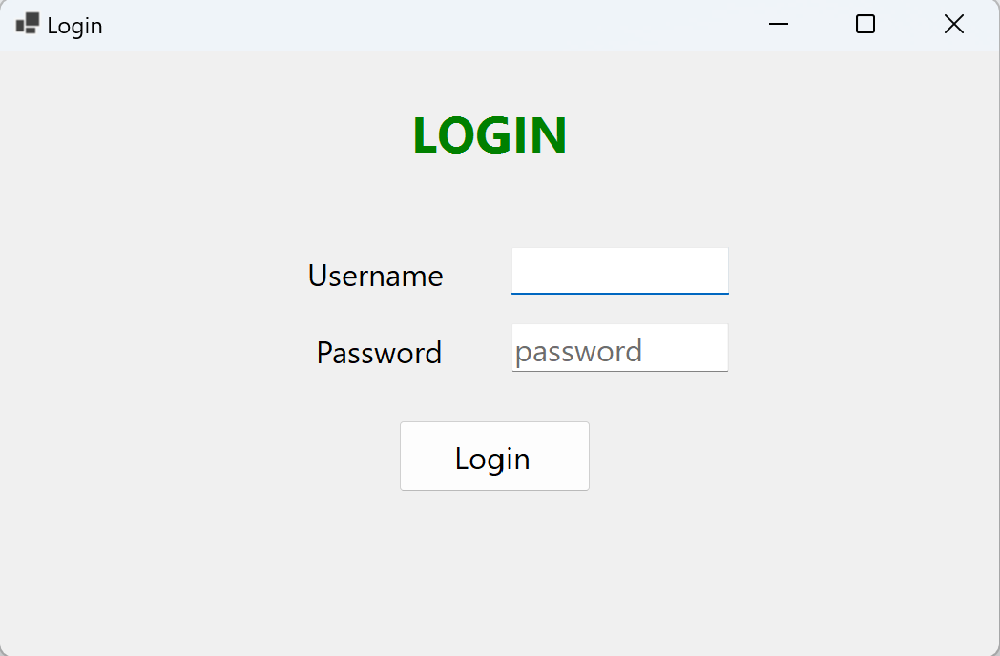
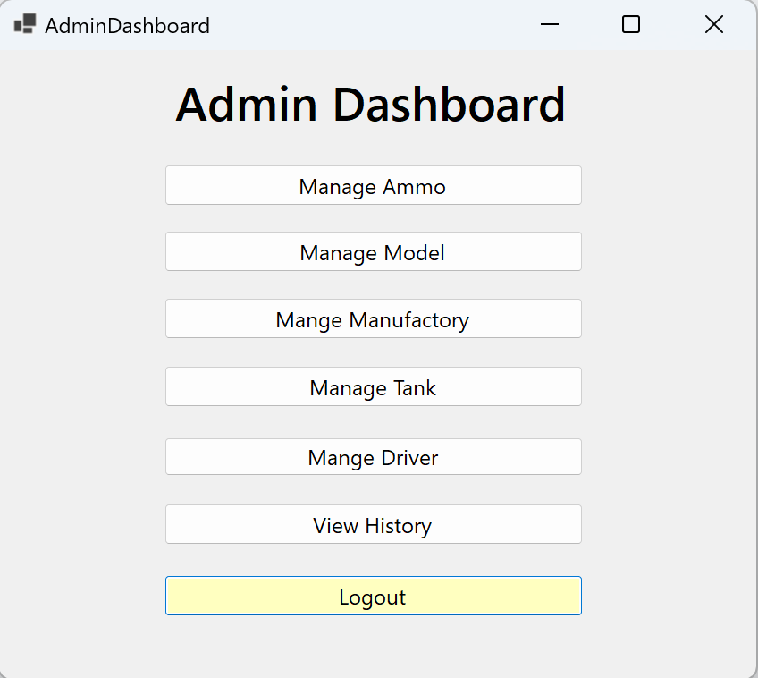
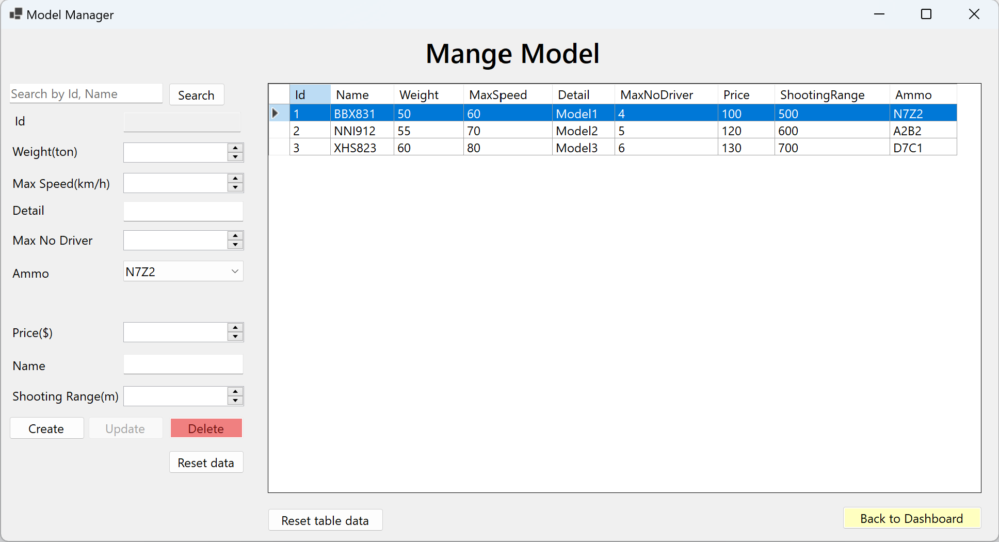
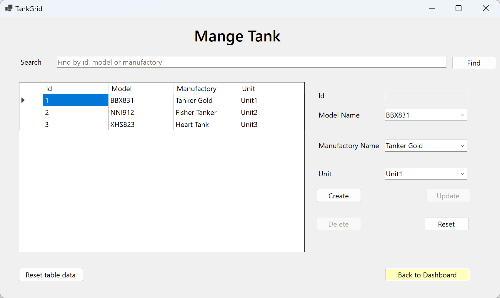
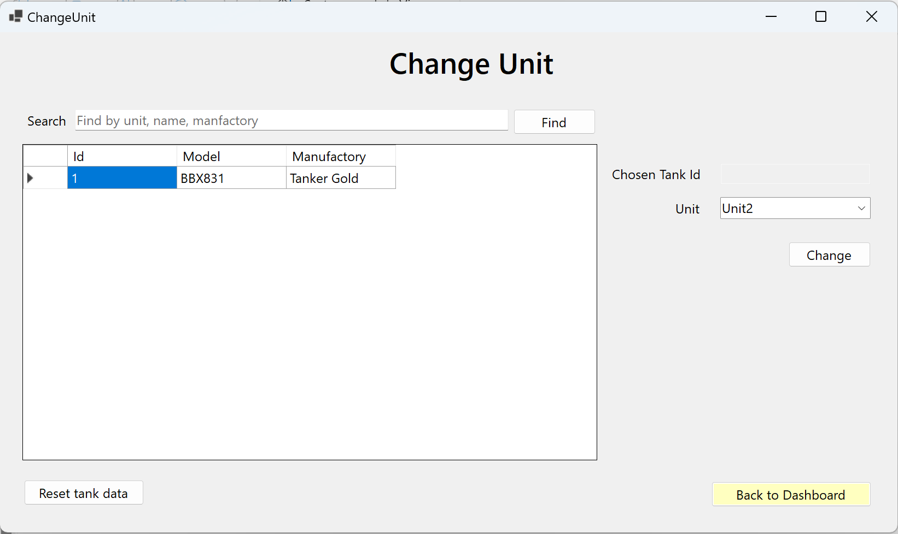

# Tank Management System

## Getting Started

To get started with this project, follow these steps:

### Prerequisites

- [.NET Core SDK](https://dotnet.microsoft.com/download)
- [Microsoft SQL Server](https://www.microsoft.com/en-us/sql-server/sql-server-downloads)
- [Entity Framework Core](https://docs.microsoft.com/en-us/ef/core/)
- [Git](https://git-scm.com/)

### Installation

1. Clone the repository:

   ```bash
   git clone https://github.com/votrongluan/tank-management-winform
   cd tank-management-winform
   ```

2. Install dependencies:
   ```bash
   cd Tank-Management
   dotnet restore
   ```

### Setting Up the Database

1. Update the `appsettings.json` (Tank-Management folder) file with your database connection string:

   ```json
   {
     "ConnectionStrings": {
       "TmDB": "server =(local); database= TM; uid=sa;pwd=12345; TrustServerCertificate=True"
     }
   }
   ```

   **Please do not commit any changes in `appsettings.json`**

2. Run the `DatabaseScript.sql` in Other folder

## Usage

### Running the Application

1. Run the application:

   ```bash
   cd Tank-Management
   dotnet run
   ```

### Examples

Here are some example usages of the application:

- Unit management
- Ammo management
- Tank management

## Screenshots

<div style="text-align: center;">
    
    <p><em>Login form</em></p>
</div>

<hr/>
<br/>

<div style="text-align: center;">
    
    <p><em>Admin dashboard</em></p>
</div>

<hr/>
<br/>

<div style="text-align: center;">
    
    <p><em>Model management</em></p>
</div>

<hr/>
<br/>

<div style="text-align: center;">
    
    <p><em>Tank management</em></p>
</div>

<hr/>
<br/>

<div style="text-align: center;">
    
    <p><em>Change unit</em></p>
</div>

<hr/>
<br/>

## Authors and Acknowledgment

Thanks to all the contributors who have helped develop this project.

## License

This project is licensed under the MIT License - see the [LICENSE](LICENSE) file for details.

## Project Status

**Not Actively Maintained**

Thank you for your interest in this project! Unfortunately, we regret to inform you that this project is no longer actively maintained. While contributions are always welcome, we recommend checking out other active projects or exploring alternative solutions.

If you have any questions or need further assistance, feel free to reach out. We appreciate your understanding and support!
